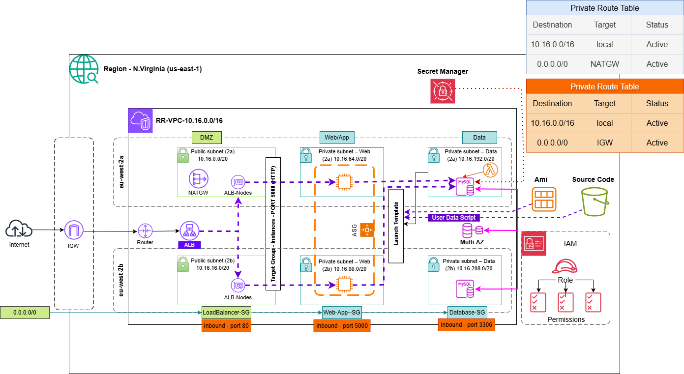

# ☁️ Terraform — Ritual Roast en AWS

Aquí vive el “cerebro” de la infra: un módulo raíz que crea red, servidores, base de datos y todo lo que la app necesita para funcionar en una región de AWS.

Si vienes del [README principal](../../README.md), ya sabes el panorama; este documento entra en el cómo y el porqué de cada pieza.

---

## 🗂️ Estructura de carpetas

```
terraform/aws/
├── main.tf                 # Une los módulos y calcula passwords / nombres de secretos
├── variables.tf            # Lo que puedes configurar (con descripciones)
├── outputs.tf              # Lo que Terraform te devuelve tras el apply
├── terraform.tfvars.example
├── templates/
│   └── ec2-user-data.sh.tpl    # Script que corre al arrancar cada EC2
└── modules/
    ├── vpc/                        # Red, subnets, NAT
    ├── security-groups/            # Quién habla con quién (ALB → app → MySQL)
    ├── alb/ + alb-target-group/    # Entrada HTTP pública
    ├── asg-web-app/                # Grupo de servidores web
    ├── ec2-launch-template/        # Plantilla de instancia (AL2023, user-data)
    ├── ec2-ssm-role/               # Permisos: SSM, S3, Secrets Manager
    ├── s3-bucket/                  # Donde vive el código de la app
    ├── db-subnet-group/            # Subredes para RDS
    ├── rds-aurora-mysql/           # MySQL 8.0 (sí, el nombre dice “aurora” pero es RDS clásico)
    ├── mysql-credentials-secret/   # Secreto JSON para la app
    ├── mysql-rotation-lambda-sar/  # Lambda de rotación en tu VPC
    └── rds-mysql-master-secret-rotation/
```

---

## 🧰 Qué necesitas instalado

| Herramienta | Versión |
|-------------|---------|
| Terraform | >= 1.1 |
| Provider AWS | ~> 5.0 |
| Provider random | ~> 3.0 |

Y credenciales AWS válidas: perfil de `aws configure`, variables de entorno, o un rol en CI.

---

## ⚙️ Cómo desplegar (paso a paso)

**1.** Copia el ejemplo de variables (el real no va a Git):

```bash
cp terraform.tfvars.example terraform.tfvars
```

**2.** Edita `terraform.tfvars` a tu gusto: región, entorno `dev`/`prod`, flags de MySQL, etc.

**3.** Lanza Terraform:

```bash
terraform init
terraform plan -out=tfplan
terraform apply tfplan
```

El primer `apply` puede tardar un rato (RDS, NAT Gateway…). Ten paciencia ☕.

---

## 💾 Dónde queda el estado (`terraform.tfstate`)

Por defecto el estado es **local** en esta carpeta. Git lo ignora a propósito: **nunca lo subas** (puede contener contraseñas en claro).

Si trabajas en equipo o en CI, descomenta en `main.tf` un backend remoto:

- **Terraform Cloud** → bloque `cloud { ... }`
- **S3 + DynamoDB** → bloque `backend "s3" { ... }`

Luego: `terraform init -migrate-state`.

---

## 🎛️ Variables que más vas a tocar

| Variable | Qué hace | Valor habitual |
|----------|----------|----------------|
| `aws_region` | Región AWS | `us-east-1` |
| `environment` | Etiqueta de entorno | `dev` |
| `project_name` | Prefijo en nombres y tags | `ritual-roast` |
| `vpc_cidr` | Rango de la VPC | `10.0.0.0/16` |
| `s3_bucket_name` | Nombre del bucket; vacío = autogenerado | `""` |
| `web_app_asg_enable` | ¿Crear el ASG? | `true` |
| `create_mysql_credentials_secret` | Secreto JSON para EC2 | `true` |
| `rds_mysql_enable_secret_rotation` | Rotar el secreto con Lambda | `true` |
| `rds_mysql_rotation_lambda_deploy_in_vpc` | Lambda de rotación dentro de la VPC | `true` |

La lista completa está en `variables.tf`. Para copiar/pegar valores, mira `terraform.tfvars.example`.

---

## 📤 Outputs que te interesan

Después del `apply`:

```bash
terraform output alb_dns_name                      # URL del balanceador
terraform output s3_bucket_name                    # Dónde subir la app
terraform output rds_mysql_credentials_secret_name # Nombre del secreto MySQL
terraform output web_app_autoscaling_group_name
```

---

## 🔐 Cómo se gestionan las contraseñas de MySQL

En `main.tf`, el bloque `locals` decide tres cosas:

1. **`rds_master_password_effective`** — la contraseña que usa RDS (la tuya, una generada al azar, o ninguna).
2. **`mysql_credentials_secret_name`** — el nombre del secreto que lee la EC2 (`MYSQL_SECRET_NAME` en el user-data).
3. **`rds_use_managed_master_password`** — si es `true`, AWS crea el secreto `rds!db-*` y Terraform no pone password.

**Config recomendada en dev** (la que trae el ejemplo):

- `create_mysql_credentials_secret = true`
- `rds_mysql_enable_secret_rotation = true`
- Sin `rds_mysql_password` → Terraform genera una contraseña y la guarda en Secrets Manager.

Cuando la rotación Lambda ya funcione bien, puedes descomentar en `modules/rds-aurora-mysql/main.tf`:

```hcl
lifecycle {
  ignore_changes = [password]
}
```

Así un `terraform plan` no intentará “arreglar” la contraseña que Lambda ya rotó.

---

## 📦 Subir la app después del `apply`

1. Terraform crea el bucket S3.
2. Tú sincronizas el código desde la raíz del repo:

```bash
aws s3 sync ../../ritual-roast-app/ s3://$(terraform output -raw s3_bucket_name)/ --region us-east-1
```

*(Cambia la región si no usas `us-east-1` — está en tu `terraform.tfvars`.)*

3. Las instancias del ASG ejecutan `ec2-user-data.sh.tpl`: instalan Python, bajan de S3, arrancan Flask en el **5000** y esperan a que `/health` responda.

---

## 🧩 Qué hace cada módulo (chuleta rápida)

| Módulo | En una frase |
|--------|----------------|
| `vpc` | Red con subnets públicas, privadas para la app y privadas para datos + NAT |
| `security-groups` | ALB → app (5000) → MySQL (3306) |
| `ec2-ssm-role` | La EC2 puede usar SSM, leer el bucket y el secreto MySQL |
| `ec2-launch-template` | Cómo se lanzan las instancias (AMI, disco, user-data) |
| `asg-web-app` | Mantiene N servidores registrados en el balanceador |
| `alb` + `alb-target-group` | Puerta de entrada HTTP desde internet |
| `rds-aurora-mysql` | Instancia MySQL 8.0 |
| `mysql-credentials-secret` | JSON con host, user, password, db, port |
| `mysql-rotation-lambda-sar` | Despliega la Lambda oficial de rotación en tu VPC |
| `rds-mysql-master-secret-rotation` | Programa cada cuántos días rota el secreto |

---

## 🛠️ Comandos del día a día

```bash
terraform fmt -recursive    # Deja el código bonito
terraform validate          # Comprueba que no hay errores obvios
terraform plan              # Qué va a cambiar
terraform apply             # Aplicar de verdad
terraform destroy           # ⚠️ Borra todo — solo en dev o si estás seguro
```

---

## 🤖 Generar tablas de variables (opcional)

Si te gusta tener la doc siempre al día con el código, prueba [terraform-docs](https://terraform-docs.io/):

```bash
terraform-docs markdown table --output-file TERRAFORM_DOCS.md .
```

Puedes commitear ese archivo o generarlo en CI.

---

## 💰 Ojo con los costes en dev

- **NAT Gateway**, **RDS Multi-AZ** y varias **EC2** encendidas 24/7 suman en la factura.
- `s3_bucket_force_destroy = true` está pensado para poder hacer `destroy` sin quedarte atascado con objetos en el bucket.
- RDS viene con `skip_final_snapshot = true` y sin `deletion_protection` — cómodo en dev, **cámbialo en prod**.

---

## 🆘 Si algo falla

| Te pasa esto… | Mira por aquí |
|---------------|----------------|
| El ALB marca las instancias como *unhealthy* | ¿Responde `/health` en Flask? Security groups, tiempo de gracia del ASG |
| La app no conecta a MySQL | Secreto en Secrets Manager, variable `MYSQL_SECRET_NAME`, SG de MySQL |
| Falla la rotación Lambda | Lambda en subnets de datos, NAT hacia la API de Secrets Manager |
| `plan` quiere cambiar la password de RDS | Activa `ignore_changes = [password]` tras la primera rotación OK |

---

## 📐 Diagrama de arquitectura



Archivo editable: [`Diagram/Arquitectura-SSA.drawio`](../../Diagram/Arquitectura-SSA.drawio)

### Cómo leerlo

1. **Región y VPC** — Todo vive en la región que pongas en `aws_region` (por defecto `us-east-1`), dentro de una VPC con tres tipos de subnet en **dos AZ** para alta disponibilidad.

2. **Capa pública (DMZ)** — El **Internet Gateway** recibe tráfico externo. El **ALB** escucha en el **puerto 80** y reenvía al target group. El **NAT Gateway** (en subnet pública) permite que las instancias privadas salgan a internet (actualizaciones, AWS APIs, `aws s3 sync`).

3. **Capa de aplicación (privada)** — El **ASG** mantiene EC2 en subnets `private-webapp`. El **Launch Template** define AMI, disco e **user-data**; ese script descarga la app desde **S3** y arranca Flask en el **5000**. El target group comprueba **`/health`**.

4. **Capa de datos (privada)** — **RDS MySQL** en subnets `private-data`, **Multi-AZ**. Solo acepta **3306** desde el security group de la web app. La **Lambda** (SAR en VPC) rota el secreto JSON en **Secrets Manager**; necesita NAT para hablar con la API de Secrets Manager.

5. **Seguridad** — Los recuadros *LoadBalancer-SG*, *Web-App-SG* y *Database-SG* corresponden al módulo `security-groups`. **IAM** enlaza roles de EC2 con S3 y `GetSecretValue`.

### ¿Encaja con este Terraform?

| En el diagrama | En el código |
|----------------|--------------|
| ALB :80 → TG :5000 | `module.alb` + `module.alb_target_group` |
| ASG + Launch Template | `module.asg-web-app` + `module.ec2-launch-template` |
| Código desde S3 | `module.app_bucket` + `ec2-user-data.sh.tpl` |
| MySQL Multi-AZ | `module.rds_mysql` + `rds_mysql_multi_az` |
| Lambda rotación | `module.mysql_rotation_sar_lambda` (si rotación activa) |
| Secrets Manager | `module.mysql_credentials_secret` |

**Diferencias solo en etiquetas:** CIDR `10.16.0.0/16` y subnets `/20` del PNG vs. default `10.0.0.0/16` y `/24` en `modules/vpc`. AZ `eu-west-2a/b` en el dibujo vs. AZ reales de tu región. **SSM Session Manager** está en el código (`ec2-ssm-role`) pero no aparece en el diagrama.

Poner el PNG en el README de GitHub es **correcto y recomendable**: se ve al abrir el repo y no expone secretos (solo topología).

---

¿Dudas o algo no cuadra con tu entorno? Abre un issue o ajusta `terraform.tfvars` y vuelve a hacer `plan` antes de un `apply` a ciegas.
